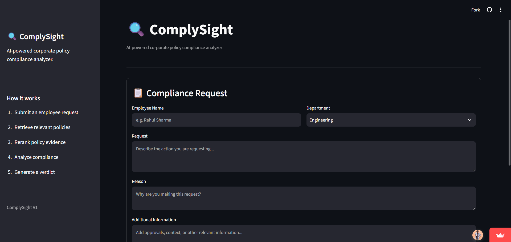
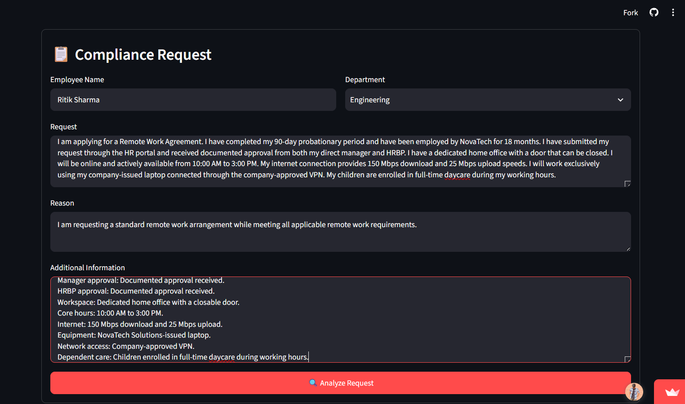
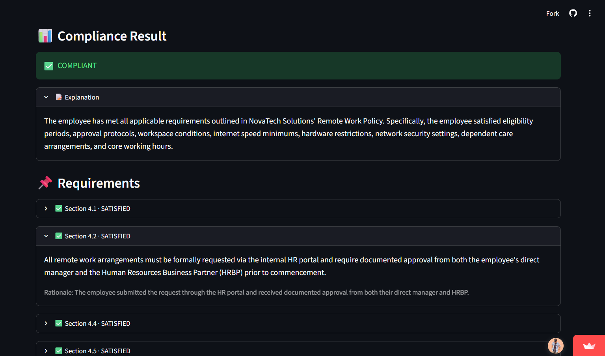
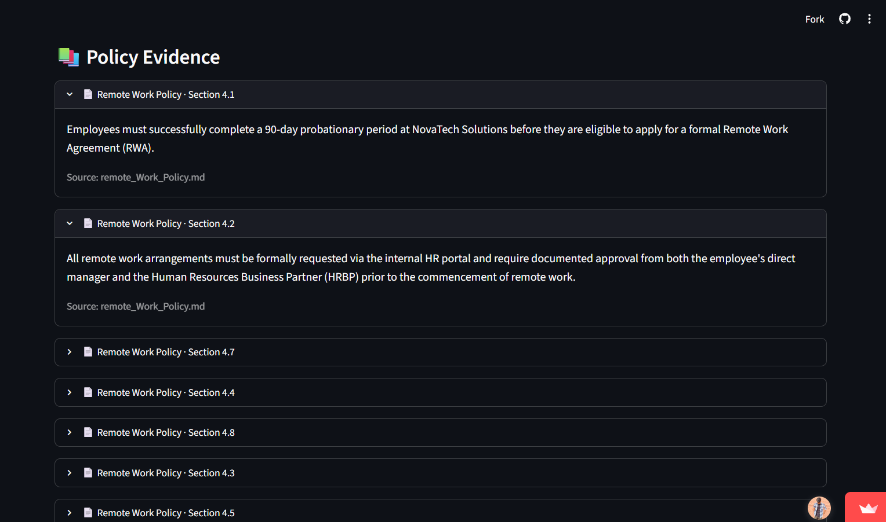
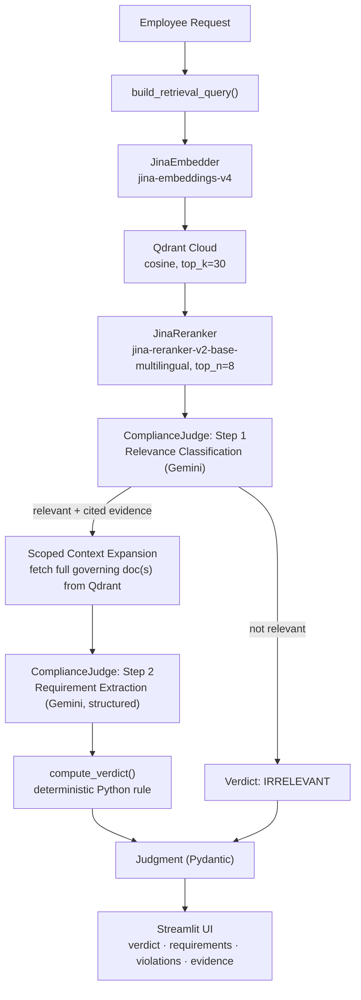

<div align="center">

# 🔍 ComplySight

**AI-powered corporate policy compliance analysis — evidence-grounded, deterministic verdicts, zero hallucinated approvals.**


<br/>

<!-- HERO SCREENSHOT / DEMO GIF -->


</div>

> [!IMPORTANT]
> This README documents the system **as implemented**, not as a roadmap. No `.env.example` or `LICENSE` currently ship in the repository — the setup section below provides the exact `.env` template needed to run the project.

---

## The Problem

Corporate policy enforcement today runs on two broken patterns:

- **Keyword / rule engines** — brittle regex and if-else trees that break the moment a request is phrased differently than the rule author anticipated. They can't tell "manager approval" from "manager notification," and they have no way to say *"I don't have enough information to decide."*
- **Manual compliance review** — accurate, but doesn't scale. A human has to read the request, find the right clause across a dozen policy documents, and reason about whether a *combination* of conditions (not just one) is satisfied.

Neither approach handles **clause ambiguity** (does "domestic travel" cover a same-day flight?), **cross-policy governance** (a cloud storage request touches both Information Security and Data Protection), or **honest uncertainty** (most systems force a yes/no verdict even when the request is missing the one fact that would decide it).

## The Solution

ComplySight retrieves the *actual governing clauses* for a request, reasons over them with an LLM constrained to structured output, and then hands the final verdict to a **deterministic Python function** — not the model. The LLM extracts and classifies; Python decides. That split is the core design bet of this system, and it shows up twice in the pipeline:

1. **Relevance is judged before requirements are extracted.** A request with no governing policy is rejected as `IRRELEVANT` before any compliance reasoning runs, and the relevance decision must cite a real evidence ID — an uncited relevance claim is programmatically downgraded to `IRRELEVANT`, not trusted.
2. **The verdict is computed from requirement statuses by a pure function (`compute_verdict`), not asserted by the LLM.** Gemini returns a list of `SATISFIED` / `NOT_SATISFIED` / `INSUFFICIENT_EVIDENCE` requirements with rationale; Python applies the decision table.

---

## Core Features

| Feature | What it actually does |
|---|---|
| **Multi-stage RAG pipeline** | Query building → dense retrieval → neural reranking → two-pass LLM judgment, each stage independently swappable. |
| **Scoped context expansion** | Once a governing policy document is identified, the judge pulls *every* section of that document from Qdrant (not just the reranked top-8), so the LLM never reasons over a truncated policy. |
| **Deterministic verdict computation** | `compute_verdict()` is a pure Python function over requirement statuses — the LLM cannot directly assert `COMPLIANT`/`NON_COMPLIANT`. |
| **Evidence-anchored citations** | Every requirement and relevance decision must cite an `evidence_id` that traces back to a real retrieved chunk; unciteable claims are stripped before the response is built. |
| **Structured, schema-validated output** | Every LLM call uses Gemini's `response_schema` against Pydantic models (`RelevanceDecision`, `AnalysisResult`) — no manual JSON parsing, no regex extraction of verdicts. |
| **Domain-spanning evaluation suite** | Ground-truth JSON test cases across 10 policy domains (access control, data protection, device usage, employee conduct, expense reimbursement, incident response, information security, password/auth, remote work, vendor management). |

---

## UI & Application Screenshots

| 📋 Request Submission Form | 📊 Analysis Result & Verdict |
|:---:|:---:|
|  |  |
| *Structured employee request input in Streamlit* | *Computed verdict, requirement statuses & rationale* |

<details>
<summary><b>🔎 Click to view Policy Evidence & Citations Preview</b></summary>
<br/>


*Evidence citations expandable view mapping each requirement to the exact policy section and source chunk.*

</details>

---

## System Architecture & Data Flow



> [!NOTE]
> The two-pass design (relevance, *then* requirements) exists specifically to stop the judge from fabricating a compliance analysis for a request that has no governing policy at all — a well-documented failure mode in single-pass RAG judges.

---

## Verdict Taxonomy

The verdict is never asserted directly by the LLM — it's computed from the set of requirement statuses Gemini returns, via `compute_verdict()` in `src/analysis/compliance_judge.py`.

| Verdict | Meaning | How it's reached |
|---|---|---|
| `COMPLIANT` | Every extracted requirement is `SATISFIED`. | All requirement statuses collapse to `{SATISFIED}`. |
| `NON_COMPLIANT` | Every extracted requirement is `NOT_SATISFIED`. | All requirement statuses collapse to `{NOT_SATISFIED}`. |
| `PARTIALLY_COMPLIANT` | Some independent obligations are met, others aren't. | Requirement statuses contain **both** `SATISFIED` and `NOT_SATISFIED`. |
| `INSUFFICIENT_EVIDENCE` | The policy applies, but the request is missing the facts needed to decide. | Any requirement is `INSUFFICIENT_EVIDENCE`, **or** relevance passed but zero requirements were extracted. |
| `IRRELEVANT` | No supplied policy governs the subject of the request. | Relevance classifier returns `is_relevant=False`, **or** returns `True` without citing a real evidence ID (auto-downgraded). |

---

## Repository Structure

```text
ComplySight/
├── app.py                          # Streamlit entrypoint — request form, verdict rendering
├── requirements.txt                # Pinned project dependencies
├── assets/                         # Application screenshots, UI previews & demo media
│   ├── demo.png                    # Hero banner / overview preview
│   ├── request_form.png            # Request submission form screenshot
│   ├── analysis_result.png         # Verdict & requirement breakdown screenshot
│   └── evidence_citations.png      # Policy evidence expansion screenshot
├── docs/                           # Project documentation & evaluation analysis
│   └── evaluation.md               # In-depth benchmark analysis & edge case breakdown
├── data/
│   ├── policies/                   # Source-of-truth Markdown policy documents (10 domains)
│   └── evaluation/                 # Ground-truth JSON test cases, one file per policy domain (10 domains)
├── src/
│   ├── pipeline.py                 # PolicyLensPipeline — wires retriever → reranker → judge
│   ├── analysis/
│   │   └── compliance_judge.py     # ComplianceJudge — relevance, expansion, requirement extraction, verdict
│   ├── evaluation/
│   │   └── evaluator.py            # PolicyLensEvaluator — programmatic single-case evaluation
│   ├── ingestion/
│   │   ├── markdown_parser.py      # Heading-aware Markdown → ParsedDocument
│   │   ├── chunker.py              # Section-bound chunking (1500 chars, 300 overlap)
│   │   ├── embedder.py             # JinaEmbedder — jina-embeddings-v4 via OpenAI-compatible API
│   │   ├── qdrant_store.py         # Qdrant collection lifecycle, upsert, scoped document fetch
│   │   └── ingest.py               # CLI: parse → chunk → embed → upsert, per policy file
│   ├── models/
│   │   └── schemas.py              # All Pydantic models: Verdict, Judgment, Evidence, chunk types
│   └── retrieval/
│       ├── query_builder.py        # ComplianceRequest → retrieval query string
│       ├── retriever.py            # Dense Qdrant search (REST, with qdrant-client fallback)
│       └── reranker.py             # Jina Rerank v2 call, with score-sort fallback on API failure
└── tests/
    ├── test_schemas.py             # Unit tests — no external calls
    ├── test_chunker.py             # Unit tests — no external calls
    ├── test_markdown_parser.py     # Unit tests — no external calls
    ├── test_pipeline.py            # Integration script — hits Qdrant + Jina + Gemini
    ├── test_retriever.py           # Integration script — hits Qdrant + Jina
    ├── test_reranker.py            # Integration script — hits Jina
    ├── test_embedder.py            # Integration script — hits Jina
    ├── test_compliance_judge.py    # Integration script — tests ComplianceJudge with live APIs
    ├── test_qdrant.py              # Connectivity & collection creation check
    ├── test_evaluator.py           # Full batch evaluation runner (see below)
    ├── check_qdrant.py             # Manual connectivity check
    └── check_collection.py         # Manual collection inspection
```

---

## Tech Stack

| Layer | Library / Service | Notes |
|---|---|---|
| Language | Python 3.10+ | Uses `X \| None` union syntax throughout `schemas.py`. |
| UI | Streamlit | Single-page form + expandable result sections in `app.py`. |
| Embeddings | Jina AI (`jina-embeddings-v4`) | Called via the OpenAI Python SDK against Jina's OpenAI-compatible endpoint. |
| Reranking | Jina AI (`jina-reranker-v2-base-multilingual`) | Direct REST call to `api.jina.ai/v1/rerank`, with a qdrant-score fallback if the API errors. |
| Vector DB | Qdrant Cloud | Collection `policylens_policies`, 2048-dim vectors, cosine distance. |
| LLM Judge | Google Gemini (`google-genai` SDK) | Default model `gemini-3.5-flash-lite`, overridable via `GEMINI_MODEL`. Structured output via `response_schema`. |
| Schema validation | Pydantic v2 | Every pipeline boundary (parsed doc → chunk → retrieved → reranked → judgment) is a typed model. |
| Config | `python-dotenv` | `.env` loaded at import time in each module that needs it. |
| HTTP | `requests` | Used directly for Qdrant REST calls and Jina reranking (bypassing the SDK for those paths). |

---

## Getting Started

### Prerequisites

- Python 3.10+
- A Qdrant Cloud cluster (or self-hosted Qdrant instance) with a reachable URL and API key
- A Jina AI API key (embeddings + reranking)
- A Google AI Studio API key (Gemini)

### 1. Clone the repository

```bash
git clone https://github.com/<your-org>/ComplySight.git
cd ComplySight
```

### 2. Create and activate a virtual environment

```bash
python -m venv .venv
source .venv/bin/activate      # Windows: .venv\Scripts\activate
```

### 3. Install dependencies

Install the pinned dependencies from `requirements.txt`:

```bash
pip install -r requirements.txt
```

### 4. Configure environment variables

Create a `.env` file in the project root:

```ini
# .env.example — copy to .env and fill in real values

# Jina AI — embeddings (jina-embeddings-v4) and reranking (jina-reranker-v2-base-multilingual)
JINA_API_KEY=your_jina_api_key_here

# Qdrant Cloud — vector store for policy chunks
QDRANT_URL=https://your-cluster-url.qdrant.io
QDRANT_API_KEY=your_qdrant_api_key_here

# Google Gemini — compliance judge (structured output)
GOOGLE_API_KEY=your_google_api_key_here
GEMINI_MODEL=gemini-3.5-flash-lite   # optional, this is the default
```

### 5. Ingest the policy documents

Parses every `.md` file in `data/policies/`, chunks it, embeds it, and upserts it into the Qdrant collection (created automatically if it doesn't exist):

```bash
python -m src.ingestion.ingest
```

### 6. Launch the app

```bash
streamlit run app.py
```

---

## Running Evaluation & Benchmarks

`tests/` mixes two different things — know which one you're running:

**Unit tests (no network calls, safe to run anytime):**

```bash
pytest tests/test_schemas.py tests/test_chunker.py tests/test_markdown_parser.py
```

**Integration scripts (hit live Qdrant / Jina / Gemini — require a funded `.env`):**

```bash
python tests/test_retriever.py
python tests/test_reranker.py
python tests/test_pipeline.py
python tests/test_compliance_judge.py
```

**Full ground-truth evaluation** — runs every case in `data/evaluation/*.json` through the live pipeline, in rate-limited batches (`BATCH_SIZE=10`, with delays tuned to Gemini's ~15 requests/minute free-tier limit), and writes `evaluation_results.json` with expected vs. actual verdict per case:

```bash
python tests/test_evaluator.py
```

### Evaluation & Benchmark Summary

ComplySight was benchmarked against a 50-case ground-truth test suite spanning all 10 corporate policy domains:

**Overall Accuracy: 68.0% (34 / 50)**

| Expected Verdict | Correct | Total | Accuracy |
|---|---:|---:|---:|
| `COMPLIANT` | 10 | 11 | **90.9%** |
| `NON_COMPLIANT` | 8 | 10 | **80.0%** |
| `PARTIALLY_COMPLIANT` | 5 | 10 | **50.0%** |
| `INSUFFICIENT_EVIDENCE` | 8 | 16 | **50.0%** |
| `IRRELEVANT` | 3 | 3 | **100.0%** |
| **Overall Total** | **34** | **50** | **68.0%** |

> 📖 **Full Benchmark Report:** For domain-by-domain metrics, evaluation methodology, and edge-case analysis, see [docs/evaluation.md](docs/evaluation.md).

---

## Sample Use Case

**Request** (`EXP-001`, Expense & Reimbursement Policy):

> *Employee: Rahul Sharma, Engineering. "Submitting my expense report for a domestic business trip to Chicago. Economy flight ($350), two hotel nights ($200/night), itemized receipts attached, corporate card used, manager already approved."*

**Pipeline behavior:**
1. Retrieval + rerank surface the Expense & Reimbursement Policy sections on receipts, submission window, approval, flight class, and hotel limits.
2. Relevance classifier confirms the request is governed by those sections and cites them.
3. Scoped expansion pulls the full policy document, not just the reranked fragments.
4. Requirement extraction checks each obligation independently: receipt threshold, 30-day submission window, manager approval, economy-class flight, hotel rate ceiling, corporate-card usage threshold.
5. All six requirements resolve `SATISFIED` → `compute_verdict()` returns **`COMPLIANT`**.

A near-identical request missing the manager approval, or citing a hotel rate over the policy ceiling, exercises the `NON_COMPLIANT` and `PARTIALLY_COMPLIANT` paths through the same six-requirement structure — which is exactly what the evaluation suite is for.

---

## Roadmap

- [ ] **PDF / DOCX ingestion** — current parser only handles Markdown; real corporate policy sets are rarely Markdown-native.
- [ ] **Multi-tenant policy silos** — namespace Qdrant collections per organization instead of a single shared `policylens_policies` collection.
- [ ] **Automated audit trail** — persist every `Judgment` (not just evaluation runs) with timestamp and requester identity for compliance record-keeping.
- [ ] **Async batch judging** — `test_evaluator.py`'s sequential batching with sleep-based rate limiting should become a proper async queue.
- [ ] **Internal naming cleanup** — unify on either "ComplySight" or "PolicyLens" across class names, collection names, and prompts.

---

<div align="center">

*ComplySight — evidence in, verdict out, no hallucinated approvals.*

</div>